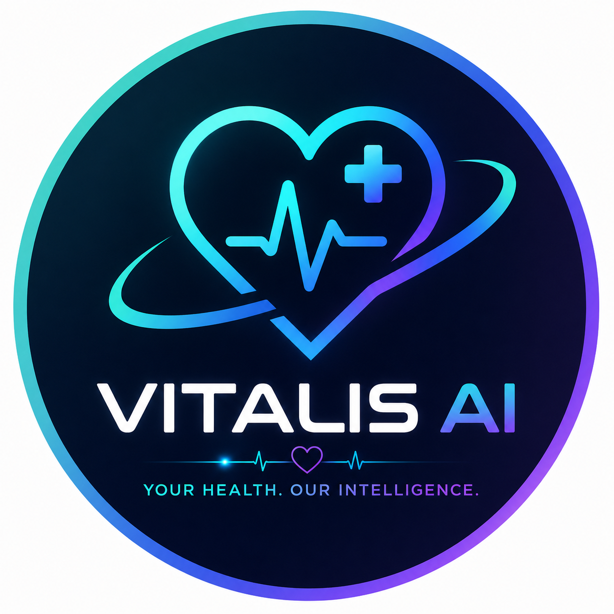
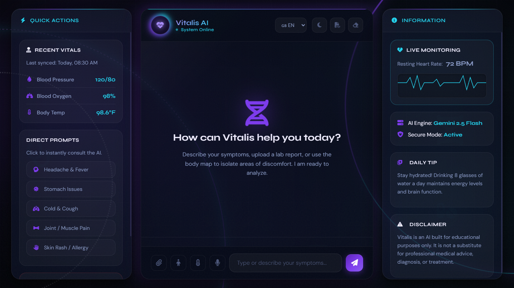

<div align="center">
  
  
  # 🧬 Vitalis AI
  
  **An intelligent, futuristic healthcare assistant powered by advanced AI**
  
  [](https://chat-vitalis-ai.vercel.app/)
  [](https://deepmind.google/technologies/gemini/)
  
  
  
</div>

<br />

Vitalis AI is a clinical-grade, modern healthcare chatbot designed to help users analyze symptoms, interact with medical reports, and receive immediate, AI-driven health insights. Built with a premium, responsive UI and secure backend processing, it offers a seamless and engaging experience.

🚀 **Live Demo:** [chat-vitalis-ai.vercel.app](https://chat-vitalis-ai.vercel.app/)

---

## 📸 Dashboard Preview

  


*(Record your app using a screen recorder and upload the GIF to `/assets/demo.gif`)*

---

## ✨ Core Features

*   🤖 **AI Symptom Checker:** Provides intelligent, highly concise preliminary medical analysis.
*   ⚡ **Quick Action Prompts:** Instantly analyze common issues (Headache, Fever, Cold, etc.).
*   🎤 **Voice Input:** Speak directly to the AI for a hands-free experience.
*   📄 **Multi-modal Reports:** Upload lab reports or prescriptions for AI visual analysis.
*   🌍 **Multilingual Support:** Chat seamlessly in English, Spanish, French, Hindi, Chinese, or Arabic.
*   🌓 **Dynamic Theme:** Beautiful dark mode and a sleek light mode with smooth transitions.
*   🖨️ **Export Session:** Download your entire diagnostic session as a PDF.
*   🔒 **Secure Architecture:** API keys are hidden behind Vercel Serverless Functions.

---

## 🛠️ Tech Stack

**Frontend:**
*   HTML5 / CSS3 (Custom Variables, Glassmorphism, Advanced Animations)
*   Vanilla JavaScript (DOM Manipulation, Fetch API)
*   [FontAwesome](https://fontawesome.com/) (Icons)
*   [html2pdf.js](https://ekoopmans.github.io/html2pdf.js/) (PDF Exporting)

**Backend / DevOps:**
*   Node.js (Serverless runtime)
*   Vercel Serverless Functions (`api/chat.js`)
*   Vercel Hosting

**AI Engine:**
*   Google Gemini 2.5 Flash API

---

## 📂 Project Structure

```text
Vitalis-AI/
├── api/
│   └── chat.js          # Vercel Serverless backend proxy for Gemini API
├── assets/              # Logos and screenshot images
├── .env.local           # Environment variables (API Key)
├── index.html           # Main UI dashboard layout
├── script.js            # Frontend logic and DOM interactions
├── style.css            # Custom styling, animations, and themes
├── vercel.json          # Deployment configuration
└── README.md            # Project documentation
```

---

## 🚀 Installation & Setup

Want to run Vitalis AI locally on your machine? Follow these simple steps:

### 1. Clone the repository
```bash
git clone https://github.com/Ritik0102-bit/Vitalis-AI.git
cd Vitalis-AI
```

### 2. Get a Google Gemini API Key
*   Go to [Google AI Studio](https://aistudio.google.com/).
*   Generate a new API key.

### 3. Setup Environment Variables
Create a file named `.env.local` in the root directory and add your API key:
```env
API_KEY=your_gemini_api_key_here
```

### 4. Install Vercel CLI
Since the project relies on serverless functions to secure the API key, use the Vercel CLI to run it locally:
```bash
npm install -g vercel
```

### 5. Run the Local Server
```bash
vercel dev
```
Your app will now be running on `http://localhost:3000`.

---

## 💡 Usage

1. **Select Language:** Choose your preferred language from the top right dropdown.
2. **Describe Symptoms:** Type your symptoms into the chat, or use the **Microphone** icon.
3. **Upload Reports:** Click the **Paperclip** icon to upload medical images.
4. **Interactive Tools:** Use the **Body Map** or **Pain Slider** icons for specific symptom targeting.
5. **Get Insights:** The AI will respond with possible causes, recommended actions, and emergency flags.
6. **Export:** Click the **PDF** icon in the header to save your conversation.

---

## 🔮 Future Improvements

- [ ] Implement a full database (MongoDB/PostgreSQL) to save user chat history across sessions.
- [ ] Add an authentication system (Auth0/NextAuth) for personalized patient profiles.
- [ ] Integrate a real-time hospital locator API using Google Maps.
- [ ] Expand the 2D body map into an interactive 3D anatomy viewer.

---

## 🤝 Contributing

Contributions, issues, and feature requests are welcome!  
Feel free to check out the [issues page](https://github.com/Ritik0102-bit/Vitalis-AI/issues).

1. Fork the Project
2. Create your Feature Branch (`git checkout -b feature/AmazingFeature`)
3. Commit your Changes (`git commit -m 'Add some AmazingFeature'`)
4. Push to the Branch (`git push origin feature/AmazingFeature`)
5. Open a Pull Request

---

## 📄 License

Distributed under the MIT License. See `LICENSE` for more information.

---

## ✍️ Author

**Ritik0102-bit**
*   GitHub: [@Ritik0102-bit](https://github.com/Ritik0102-bit)

---
<div align="center">
  <i>Disclaimer: Vitalis AI is built for educational purposes only. It is not a substitute for professional medical advice, diagnosis, or treatment.</i>
</div>
